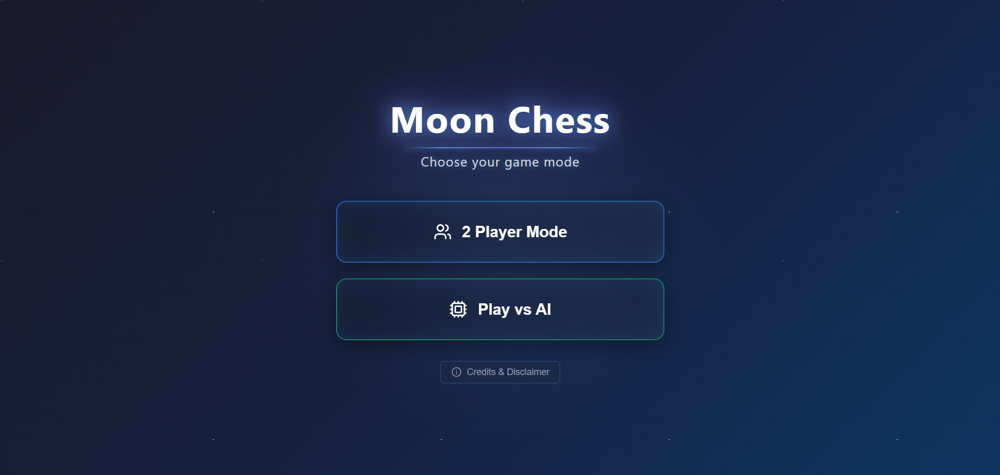
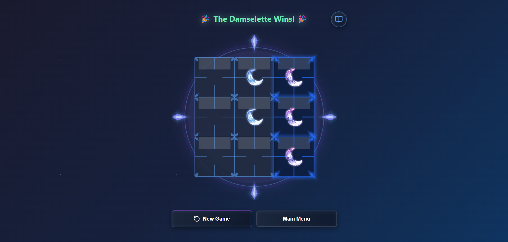
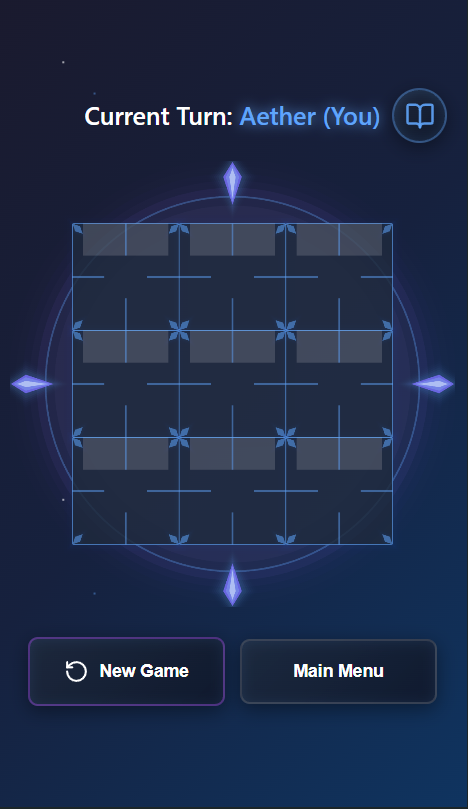

# 🌙 Moon Chess - Tic Tac Toe with a Twist

A mystical, space-themed Tic Tac Toe game with a unique disappearing mechanic. Built with React and PixiJS for smooth, animated gameplay.

  

## 🎮 [Play Now](https://vawndyu.github.io/Moon-Chess)

---

## ✨ Features

- 🎯 **Unique Gameplay Mechanic**: Players can only have 2 pieces on the board - your oldest piece vanishes when you place your 3rd!
- 👥 **2 Player Mode**: Play against a friend locally
- 🤖 **AI Opponent**: Challenge the computer with smart AI moves
- 🎨 **Beautiful Design**: Space-themed UI with glowing effects and smooth animations
- 📱 **Mobile Friendly**: Fully responsive design that works on all devices
- ⚡ **Smooth Performance**: Powered by PixiJS for hardware-accelerated rendering

---

## 🎲 How to Play

### Objective
Align 3 pieces in a row (horizontally, vertically, or diagonally) to win!

### The Twist
Each player can only have **2 pieces** on the board at a time. When you place your 3rd piece, your oldest piece automatically disappears. Watch for blinking pieces - they're about to vanish!

### Controls
- **Click** on any empty cell to place your piece
- **Hover** over cells to preview your move
- Use the **Rules** button (📖) to review gameplay anytime

---

## 🛠️ Technologies Used

- **React** - UI framework
- **PixiJS** - High-performance 2D rendering
- **Vite** - Build tool and dev server
- **Lucide React** - Icon library
- **CSS3** - Animations and styling

---

## 🚀 Local Development

### Prerequisites
- Node.js 16+ and npm

### Installation

1. Clone the repository
```bash
git clone https://github.com/yourusername/moon-chess.git
cd moon-chess
```

2. Install dependencies
```bash
npm install
```

3. Start development server
```bash
npm run dev
```

4. Open [http://localhost:5173](http://localhost:5173) in your browser

### Build for Production
```bash
npm run build
```

---

## 📂 Project Structure
```
moon-chess/
├── src/
│   ├── components/          # React components
│   │   ├── PixiGameBoard.jsx
│   │   ├── ModeSelection.jsx
│   │   ├── GameStatus.jsx
│   │   ├── RulesModal.jsx
│   │   └── helpers/         # PixiJS helper functions
│   ├── hooks/               # Custom React hooks
│   │   └── useGameLogic.js
│   ├── utils/               # Utility functions
│   │   └── gameHelpers.js
│   ├── constants/           # Configuration
│   │   └── gameConfig.js
│   ├── App.jsx
│   └── App.css
├── public/
│   ├── img/                 # Game assets
│   └── screenshots/
└── package.json
```

---

## 🎨 Customization

### Change Board Size
Edit `src/constants/gameConfig.js`:
```javascript
export const CellConfig = {
    size: 120,  // Change cell size
    gap: 0,
};
```

### Adjust Glow Effects
Modify glow intensity in `gameConfig.js`:
```javascript
export const GlowConfig = {
    borderLayers: 4,
    borderBaseAlpha: 0.25,
    // ... more glow settings
};
```

---

## 📸 Screenshots

### Main Menu


### Gameplay


### Mobile View


---

## 🤝 Contributing

Contributions are welcome! Feel free to:
- 🐛 Report bugs
- 💡 Suggest new features
- 🔧 Submit pull requests

### Steps to Contribute
1. Fork the repository
2. Create a feature branch (`git checkout -b feature/AmazingFeature`)
3. Commit your changes (`git commit -m 'Add some AmazingFeature'`)
4. Push to the branch (`git push origin feature/AmazingFeature`)
5. Open a Pull Request

---

## 📝 License

This project is licensed under the MIT License - see the [LICENSE](LICENSE) file for details.

---

## ⚠️ Disclaimer

**Moon Chess** is a fan-made mini game inspired by **Genshin Impact**.

- All character artwork and visual assets (including Aether, Lumine and The Damselette character names) are the property of **HoYoverse/miHoYo**.
- This is a **non-commercial**, **unofficial** project created by fans for fans.
- This project is not affiliated with, endorsed by, or connected to HoYoverse/miHoYo in any way.
- No copyright infringement is intended. All rights to the original characters and artwork belong to their respective owners.

If you are a representative of HoYoverse/miHoYo and have concerns about this project, please contact me and I will address them promptly.

---

## 🙏 Acknowledgments

- **HoYoverse/miHoYo** for creating the beautiful Genshin Impact universe and characters
- **PixiJS Team** for the amazing rendering library
- **React Community** for the robust framework
- All contributors and players who support this project

---

## 📧 Contact

**Vonne Dew**
- GitHub: [@VawnDyu](https://github.com/VawnDyu)
---

## 🌟 Star This Project

If you enjoyed playing Moon Chess, please consider giving it a ⭐ on GitHub!

---

**Made with ❤️ by a Genshin Impact fan**

*Last Updated: November 2025*